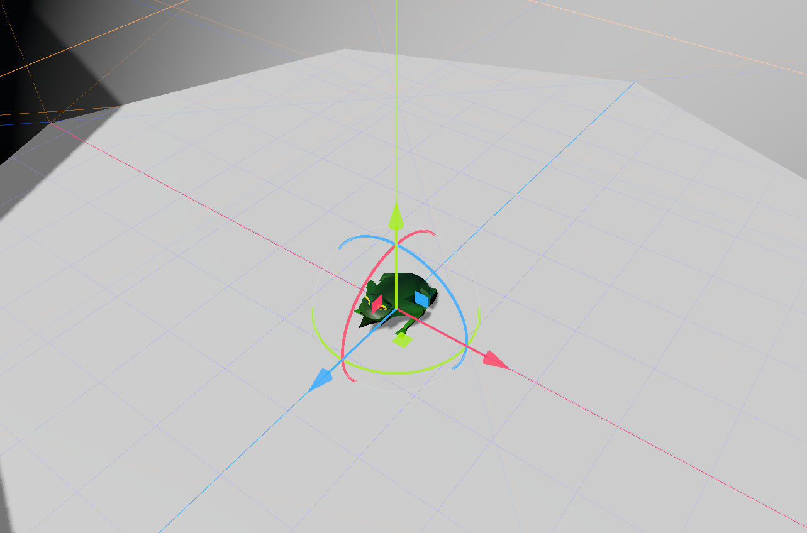

# Godot Frog Demo

## Intro

This project demonstrates the usage of "root motion" animation as applied
to creature skeletons. It uses three animations to create a frog that jumps
around a stage.

The animations are `Idle`, `TurnRight` and `Hop`. Turning left is accomplished
by playing the right hand turn in reverse.

# License

MIT & CC0 Licensed. You may choose which you prefer.
